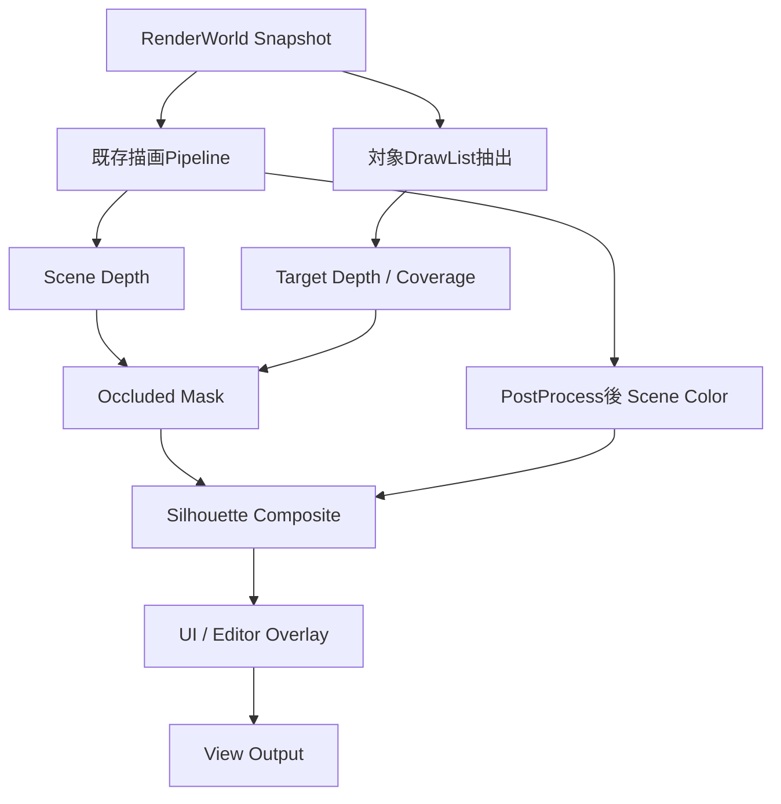

# レンダラ第1版 完成計画 — RenderGraphと遮蔽シルエット

作成日: 2026-09-07  
状態: 計画作成済み・実装未着手  
調査基準: `agent/csm-unity-inspector` / `1d1aeefdc22950292e2158737f18ffa7613ddd88`

## 1. 今回の完成地点

ユーザーとの会話で、レンダラ第1版の完成条件を次に定めた。

> アニメーションするプレイヤーが壁などで遮蔽されても、隠れた部分を影のようなシルエットで表示できる。その表現をRenderGraphの描画構成として追加・切り替えできる。

既存描画をGraph経由にしただけでは完成としない。通常Pipelineに対象抽出・Mask生成・合成を追加し、実際に描画表現を拡張できたことを実証する。

本書の「シルエット」は遮蔽時の透視表示であり、光源から影領域を作るStencil Shadow Volumeではない。目的の表示を満たすことを必須とし、Stencilを使うこと自体は必須としない。

### 決定事項と設計案の区別

- **合意済み:** RenderGraphを第1版の範囲に入れる。遮蔽プレイヤーのシルエット表示を最終実証とする。
- **本計画の提案:** Target Depth + Mask方式、初版の対象範囲、工程分割、検証方法。
- **RV0で確定するもの:** 基準Scene、対象PC、品質、性能予算、見た目の許容差。現時点で60fpsなどの達成を約束しない。

## 2. 既存計画との関係

本書は第1版の到達範囲と受入条件を定義する。既存の所有権・資源・実行順序の契約を無効化しない。

参照:

- [RenderPipeline Graph Architecture](RenderPipeline_Graph_Architecture.md)
- [RenderPipeline Graph Integration Plan](RenderPipeline_Graph_Integration_Plan.md)
- [Execution Order Amendment](RenderPipeline_Graph_Execution_Order_Amendment.md)
- [Resource / DLL Contract](RenderPipeline_Graph_Resource_And_DLL_HotReload_Contract.md)
- [RenderWorld / Runtime Ownership Progress](Step18A_RenderWorld_Runtime_Ownership_Progress.md)
- [Model Material Foundation Progress](Step18I_Model_Material_Import_Foundation_Progress.md)
- [CSM現在仕様](Step19A10_CSM_Common_Max_Depth_Experiment.md)
- [長期ビジョン](Project_Vision_Robocraft_Roadmap.md)

高水準RenderPipelineGraphと既存の低水準RHI::RenderGraphを維持し、依存解析や資源寿命を二重実装しない。最小PipelineInstanceは既存PostProcessの移行より前に導入する。

既存追補のStep18-A順序（所有権、Geometry Revision、Snapshot/Handle、Shadow Baseline、旧経路撤去、Command境界、Shadow Parity）をRV1の前提として扱う。既存文書の未チェック項目は古い可能性があるため、実装・テスト・実機記録で再判定し、完了済みの作業を重複させない。

本書で範囲外とした上位機能は後続版へ残す。DLLを将来拡張できる契約と、実際のDLL Reload機能は分ける。

## 3. 現状と差分

以下は調査基準時点のコード確認結果。現在のフルビルドや実機表示が合格済みという意味ではない。

| 項目 | 現状 | 第1版に必要な差分 |
|---|---|---|
| 低水準RenderGraph | 依存、Barrier、Lifetime、Pass Cullingなどの基盤あり | 実描画接続、Resource Version / Hazard不足の確認 |
| 高水準Pipeline Graph | 設計・統合計画あり | Asset、Registry、Compiler、Operation、Instanceの実装 |
| RenderWorld | Extractionと共有Geometry管理が進行 | 必要なSnapshot/Handle境界、Command生成への接続 |
| 既存Pass | 固定構成とLegacy実装が残る | 宣言された資源を受け取るAdapterから段階移行 |
| RHI Depth Texture | DSV/SRV用のtypeless変換とView生成あり | Graph経由のDepth受け渡し、競合解除・再Bindの実機確認 |
| RHI Stencil State | DepthStencilDescにStencil設定なし。BackendはStencil無効固定 | Mask方式の初版には不要。Stencil方式を採る場合に追加 |
| 既存GBuffer | Native Stencil Stateを材質描画に使用 | シルエットが既存StencilをClear/上書きしない設計 |
| 遮蔽対象の描画 | 汎用の対象選択と追加Draw経路は未検証 | Stable Entity識別によるDrawList抽出、Skinning結果再利用 |

主な確認先:

- `Source/GameApplication/Service/Graphics/RHI/RHIDescriptors.h`
- `Source/GameApplication/Service/Graphics/RHI/RHIRenderGraph.h`
- `Source/GameApplication/Service/Graphics/RHI/D3D11/D3D11RHITextureRuntime.h`
- `Source/GameApplication/Service/Graphics/RHI/D3D11/D3D11RHIPipelineRuntime.h`
- `Source/GameApplication/Engine/Scene/System/Render/RenderSystem/`

## 4. 初版の範囲

### 必須

- D3D11、単一Graphics Queueで既存の主要フレーム描画をGraphから実行する。
- Shadow、GBuffer、Lighting、Forward、既存PostProcess、UIの依存と入出力を明示する。
- Graph定義を保存・再読込し、通常構成とシルエット構成を切り替える。
- Player View / Editor ViewのInstance、資源、パラメータを分離する。
- 1 Viewにつき対象プレイヤー1体。不透明な通常モデルとSkinned Modelを対象とする。
- 不透明な遮蔽物による完全遮蔽・部分遮蔽を扱う。
- 暗色の半透明シルエットを基本とし、色・不透明度・有効/無効を設定可能にする。
- Maskの確認表示、Graphの実行順、Pass時間、接続エラーを確認できる。
- 既存の影、材質、アニメーション、Picking、UIを回帰させない。

### 今回の完成条件に含めない

- Stencil Shadow Volume、光源ごとの影方式追加。
- 輪郭線、ぼかし、発光、距離フェード、Temporalな残像防止。
- 複数対象の色分け、優先順位、対象同士の透視規則。
- 半透明物を遮蔽物として扱うこと。初版では透視判定の遮蔽物に含めない。
- Alpha Maskedな対象モデル、特殊な頂点変形、MSAA。必要になった時点で別工程化する。
- ノードエディタの全面改修、任意Subgraph、全Nodeのライブプレビュー。
- 高度なHistory、DLL Hot Reload実行、複数GPU Queue、物理メモリエイリアシング。
- D3D12/Vulkan対応、完全非同期描画、全PassのNative Operation化。
- GBuffer圧縮など、今回の予算を満たすために不要な追加最適化。

既存機能の動作維持と、新しいシルエット機能の対応範囲は区別する。例えば既存の半透明描画は維持するが、半透明を遮蔽物として認識する機能は初版では実装しない。

## 5. 描画設計案

### 5.1 Graph構成

通常Pipelineは依存関係を宣言し、登録順や以下の図の見た目だけに実行順を依存させない。

最初の合成位置はPostProcess後・UI/Editor Overlay前に固定する。最終表示用の色空間を契約に含める。別位置へ接続する場合はHDR/LDRやColor Spaceの適合を検証し、無条件に接続可能とはしない。

### 5.2 Target Depth + Mask方式を第一候補にする

1. Scene Depthは通常の不透明描画から取得する。プレイヤー自身を含む。
2. 選択した対象だけを別のDepthへ描き、その画素の最も手前の対象表面を保存する。Coverageも明示的に保持する。
3. 同じView、投影、Viewport、深度表現でTarget DepthとScene Depthを比較する。
4. 対象が存在し、対象の最前面がSceneの最前面より奥にある画素だけをOccluded Maskにする。
5. 元のScene Colorを読み、別の出力Textureへ一度だけ合成する。

標準Depthでは概念的に `TargetDepth > SceneDepth + epsilon` が遮蔽条件になる。ただしRaw Depthへ無条件に固定epsilonを足す実装にはしない。深度規約、比較空間、精度、近遠での許容差をRV5で決める。Reversed-Zを扱う場合は比較方向も変わる。

**単に対象の全三角形をGREATERで重ね描きしない。** 見えているプレイヤーの奥側の面まで隠れた面として検出し、自己遮蔽を透視表示するおそれがある。最前面のTarget Depthと明示Coverageを使い、可視部分を除外する。

対象なし、無効Entity、画面外ではCoverage/Maskを0にし、前フレームの形状を残さない。DepthのClear値だけを有効画素判定に使わない。

### 5.3 アニメーションと対象指定

- ゲーム側はEntity Handleなどの対象識別を供給する。RendererにPlayerController等のゲーム固有型をincludeしない。
- Scene Context、Entity世代、View identityを含めて対象を解決する。
- Mask生成は通常描画と同一フレームのTransform、SubMesh、Skinning結果を使う。
- Animation更新やCompute Skinningをシルエット用にもう一度進めない。
- DrawList抽出をPrepare/Extractionとして扱い、Graph実行中にECSへ構造変更を行わない。
- 新しい処理は汎用の対象選択、Raster、Fullscreen Operationを組み合わせる。

### 5.4 Depth / Texture / Resource契約

- DepthをSRVで読むPassでは、競合するWritable DSVを解除する。初版はDSVとの同時Bindを必要としない構成にする。
- Scene ColorをSRVとRTVへ同時に指定しない。合成先を別Resource Versionとして扱う。
- Resourceの型、Format、Color Space、Extent、Sample Count、View、Read/Write、Load/Clear/Storeを宣言する。
- Scene Depth、Target Depth、Coverageは同じ内部解像度・画素位置で生成する。合成先の大きさが異なる場合は座標変換を明示する。
- 初版はSample Count 1。MSAA入力を黙って扱わず、非対応として診断する。
- Scene DepthをMask用に書き換えない。既存Picking/Material用Stencilも変更しない。
- Frame内一時Resourceは低水準Graph側の管理に集約し、GPU利用中に再利用・破棄しない。
- Camera/View固有設定と実行状態はPipelineInstanceへ置き、共有Assetへ混在させない。

Stencil方式を後に追加する場合はEnable、Read/Write Mask、Ref、Front/BackのFail/DepthFail/Pass/CompareをRHIで表現する。既存材質用Stencilとのbit利用契約を必須とし、無条件の全Stencil Clearを避ける。

## 6. 実装ロードマップ

各工程は個別にレビュー可能な変更へ分ける。次工程へ進める条件を満たしたら、対象外の改善を同じ工程へ追加しない。

| 工程 | 主な成果物 | 完了ゲート |
|---|---|---|
| RV0 基準固定 | 現状棚卸し、固定Scene、画像、性能予算、対応範囲 | 再現条件と比較方法が揃う |
| RV1 移行前提を閉じる | Step18-A所有権/Revision/Snapshot/Command境界、置換済み旧経路撤去 | 必須テスト・Build・Shadow Parityが通る |
| RV2 Graph最小実行 | Asset/ID/Registry、Compiler、Operation Lowering、最小Instance | 保存した小さなGraphでD3D11実描画し、誤接続を診断できる |
| RV3 既存描画移行 | PostProcess互換、Pass Adapter、Builtin Pipeline | 主要フレーム描画がGraphを通り、通常表示が一致する |
| RV4 対象描画経路 | 汎用対象選択、DrawList、Target Depth/Coverage | 静的・Skinned対象だけを正しく再描画できる |
| RV5 遮蔽シルエット | Mask、Composite、設定、比較用Graph | 部分遮蔽と動く対象を正しく表示できる |
| RV6 受入・第1版固定 | 回帰試験、実機記録、性能比較、利用例、残課題一覧 | §8の全項目が合格し、第1版完了を記録する |

### RV0: 最初に行うこと

- [ ] Git基準、対象PC/GPU/Driver、Debug/Release、解像度、品質を記録する。
- [ ] 既存計画の完了/未完を現コードと証拠で棚卸しする。
- [ ] 現在作業中のCSM/Materialについて、固定基準を作るための残作業を列挙する。
- [ ] 標準Scene、影の回帰Scene、シルエット検証Sceneを指定する。
- [ ] ベース描画のCPU/GPU平均・P95と、比較画像を保存する。
- [ ] 「Graph移行で許容する増分」と「シルエット有効時の増分」の上限をmsで決める。
- [ ] 画像比較の許容差、計測サンプル数、通常描画の品質条件を決める。

計測はウォームアップ後の同条件で複数回行う。暫定手順は各条件600フレーム×3回。起動・Shader Compile・Asset Loadのスパイクは通常描画と別記録にする。目標が厳しい場合も、改善のたびに合格基準を緩めない。変更は理由と影響を記録する。

### RV1: 設計移行の前提

既存追補§2の依存順序を守る。現在の見た目を保存してからGeometry/Command経路を変更し、同条件でShadow Parityを検証する。

古いFacadeの削除と、意図的な機能Fallbackは区別する。置換を実証した不要コードを撤去し、対応外材質を通常描画へ戻す等の正しさに必要なFallbackを一括削除しない。

全ComponentのSnapshot化や全Rendererの非同期化までは含めない。残るComponent依存には、現在必要なRead Hazardと寿命保証を維持する。

### RV2: 小さなGraphを実行する

Clear → Fullscreen → View Outputなどの小さな構成で、保存/読込/Compile/実行を通す。

- 高水準Compilerが型、必須入力、循環、未知Node、Resource Versionを検証する。
- Operationから既存低水準RenderGraphへ変換し、資源依存を実Drawへ接続する。
- 最終Output/Present/外部副作用をCulling Rootとして扱う。
- 無効Graphは実行せず、Node/Slotと理由を表示する。
- 編集時のCompile失敗は最後の有効Pipelineを保持する。初回から有効なPipelineがない場合は明示的なエラー表示とし、成功扱いしない。
- Graph切替は安全なFrame境界で行う。
- 最小InstanceはScene Context + Camera Entity + Viewport Scopeを識別し、Resize/Delete/Reloadで無効化する。

### RV3: 既存フレームを移す

最小Instanceを用意した後、既存PostProcess、Legacy Pass Adapter、Prepare/DrawList/RenderViewの順に接続する。

Adapterは資源アクセスと外部副作用を宣言し、内部で参照するTextureをGraphに隠さない。Nativeな処理が必要な場合は隔離したExternalOperationとし、状態Cacheの無効化・再Bindの契約を持つ。

中央の実行器がNodeのゲーム固有名やEffect固有名で分岐しない。新NodeはRegistryへ登録できる。接続順は宣言された依存で決まり、登録順だけに依存しない。

### RV4–5: 拡張性を実証する

通常PipelineとシルエットPipelineを別Assetとして保存する。Renderer実行器へシルエット専用分岐を追加せず、対象選択とOperation追加で成立させる。

実装時に欠けている汎用APIを追加することは許容する。禁止するのは、汎用境界を設けずPlayer専用処理を中央へ埋め込むこと。

Mask単体表示で判定を検証した後に合成する。暗色半透明を既定とし、色・不透明度・有効/無効の変更と保存を通す。

## 7. 検証計画

### 自動検証

| 対象 | 検証する内容 |
|---|---|
| Compiler | 必須入力、型/Format/Extent不整合、循環、未知Node、安定順、Output保持 |
| Resource | Read/Write Hazard、DSV/SRV競合、別Versionへの合成、一時資源の寿命 |
| Asset | 保存/読込、Stable ID、設定保持、無効Assetでの診断 |
| Instance | 二つのViewの設定分離、Resize/Delete/Reload、無効化されたHandle |
| 対象選択 | 別Sceneの同番号Entity、世代違い、対象削除、対象なし |
| Mask判定 | 可視、完全遮蔽、部分遮蔽、Coverageなし、同深度、許容差 |
| 描画経路 | 小さなD3D11実描画テストで期待Pixelを確認 |

ソース内の文字列検査だけで、GPU描画・Play/Stop・資源寿命の検証済みとはしない。Runtimeと実機の証拠を分けて残す。

### 固定Sceneと実機受入

| ケース | 期待結果 |
|---|---|
| 壁なし | Maskが空で、通常のプレイヤー表示が変わらない |
| 完全遮蔽 | 画面に投影された対象の隠れた形状を表示する |
| 部分遮蔽 | 壁で隠れた部分だけ表示し、可視部分を塗らない |
| 自己遮蔽 | 腕・胴・背面の重なりだけでは、見えている対象に誤表示しない |
| 壁へ出入り | 境界が追従し、前フレームのMaskが残らない |
| アニメーション | 通常モデルとシルエットのPose/Transformが一致する |
| Camera移動 | 視点・Near Clip・画面端で不正な面や残留が出ない |
| 対象削除/切替 | 古い対象の表示が残らない |
| 二つのView | 別Camera/設定で正しく判定し、資源が混線しない |
| Resize | 再生成後もDepth/Mask/Colorの位置が一致する |
| Graph切替/保存読込 | 通常構成とシルエット構成が再現する |
| Play/Stop/Reload | 繰り返して表示が戻り、資源数が増え続けない |
| 既存描画 | CSM/Point/Spot、Static Batch、通常Model、Skinning、Picking、UIが回帰しない |
| 半透明物だけが手前 | 初版の仕様どおり、半透明物を理由にMaskを発生させない |

初回の反復基準はPlay/Stop/Scene Reloadを各20回、View Resizeを往復20回とする。Mask無効時/有効時の画像、CPU/GPU時間、Resource数を比較する。D3D11 Debug Layerの既知メッセージと新規問題を区別し、今回の経路での競合・寿命違反を残さない。

## 8. レンダラ第1版の完成チェック

- [ ] 通常の主要フレーム描画が保存可能なGraph定義を通る。
- [ ] シルエットが中央の専用分岐ではなく、登録Node/Operationと接続で追加されている。
- [ ] 不透明なアニメーション対象の完全遮蔽/部分遮蔽で正しく表示する。
- [ ] 可視部分や自己遮蔽を誤って塗らない。
- [ ] Camera/View、Resize、削除、Play/Stop、Scene Reloadで状態が混線しない。
- [ ] Graph保存/読込/切替と、不正Graphの診断が機能する。
- [ ] 通常描画、影、材質、Skinning、Picking、UIの固定回帰が合格する。
- [ ] RV0で確定した性能予算を満たし、有効/無効のコストを説明できる。
- [ ] Windows Debug/Release x64 Buildと対象テストが成功し、実機受入記録がある。
- [ ] 対応範囲、設定方法、再現用Scene、残課題が文書化されている。

すべてを満たしたら、後続機能が残っていても「レンダラ第1版完了」とする。ノードUI拡張、追加最適化、別Backend、特殊な透視表現を理由に、この完了地点を後から移動しない。

## 9. 進捗と変更の記録方法

各実装単位に次を記録する。

- 対象工程: RV0–RV6。
- 今回使えるようになることと、完了ゲート。
- 変更前後のCommit、Scene、設定、画像、計測結果。
- 自動テストと実機確認の別、および未確認項目。
- 見つかった課題が「今回必須」「現在変更に必要」「後続版」のどれか。

将来必要になりそうという理由だけで必須範囲を増やさない。完了条件を変更するときは、ユーザーの目的との関係と、到達時期への影響を明記する。

本計画作成時点では実装や実機検証を開始していない。既存テストの過去の成功だけで、上記チェックを完了へ変更しない。
