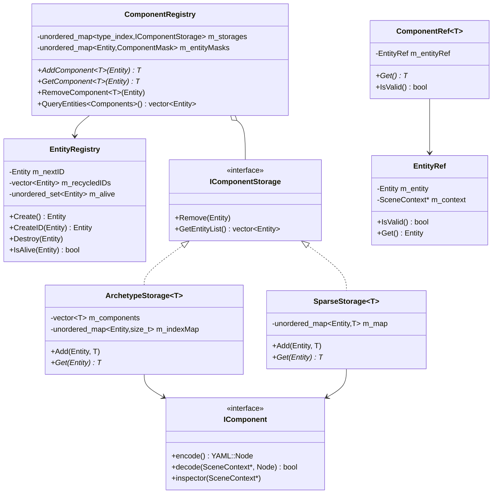
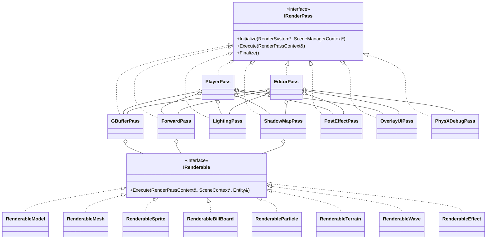
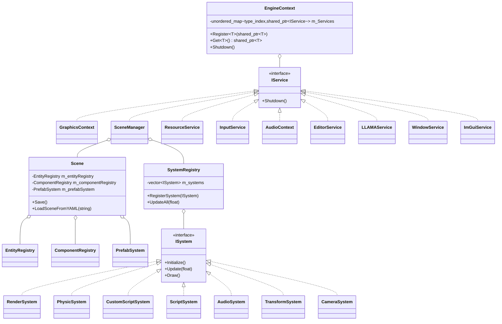

# GameApplication
つよつよゲームエンジンを作りたい！
DirectX 11 ベースの自作ゲームエンジン（C++）。Unity / Unreal Engine 5 のような汎用エンジンのアーキテクチャ品質を目指して個人開発中。

---

## 目次

1. [プロジェクト概要](#プロジェクト概要)
2. [クラス図](#クラス図)
3. [サードパーティライブラリ・ライセンス](#サードパーティライブラリライセンス)

---

## プロジェクト概要

### コアアーキテクチャ

- **DI コンテナ** (`EngineContext`)：型をキーにしたサービス登録・取得、登録の逆順で `Shutdown`
- **ECS**：`EntityRegistry`（ID 再利用つきエンティティ管理）/ `ComponentRegistry`（コンポーネント種別ごとに `SparseStorage` か `ArchetypeStorage` を選択可能）
- **安全な参照**：`EntityRef` / `ComponentRef<T>` による生存チェック付きハンドル（マルチシーンでも `SceneContext` 単位で一意）
- **システム管理**：`ISystem` ベースの `SystemRegistry`（`Initialize / Start / Update / FixedUpdate / Draw / Stop / Finalize` をまとめて呼び出し）
- **シーン管理**：複数シーンの同時アクティブ化、YAML 保存/読込、Play/Stop 切り替え時の一時保存・復元（`TempSave` / `TempLoad`）
- **Prefab システム**：階層構造・親子関係を保ったままの保存／インスタンス化

### レンダリング

- **Deferred + Forward ハイブリッドパイプライン**：GBuffer → ShadowMap → Lighting(Deferred) → Forward(半透明) → PostEffect → OverlayUI
- **マテリアル**：`ShaderID` 切り替え式、HLSL ソースをランタイム自動生成・コンパイル・依存関係付きキャッシュ（`ReCompilePixelShaders`）
- **シェーディングモデル**：PBR / Unlit / Toon / RimToon / PBRToon
- **シャドウ**：CSM（カスケードシャドウマップ）、Point/Spot シャドウ、共有シャドウアトラス
- **ポストエフェクト**：ノードグラフ（imnodes）+ トポロジカルソートで実行順を解決。Bloom、SSAO、SSR、被写界深度、各種ブラー、Kuwahara、Posterize、Mosaic、Glitch、色収差、アウトライン（法線/深度/ShaderID 3方式）、レンズフレア、ゴッドレイ、深度フォグ
- **スキニングアニメーション**：GPU Compute Shader（CS）スキニング + CPU フォールバック、複数アニメーションのブレンド
- **ビルボード／スプライト／パーティクル／地形／波メッシュ**の専用 Renderable
- **環境マップ**：スカイスフィアからの自動反射マップ更新

### 物理

- **PhysX 統合**：Box / Sphere / Capsule / Mesh / HeightMap コライダー、Static/Dynamic 剛体、トリガー、レイヤーマスク付きレイキャスト

### スクリプティング

- **C++ カスタムスクリプト**：`BEGIN_REFLECT` / `REFLECT_FIELD` マクロでフィールドの YAML シリアライズとインスペクタ UI を自動生成
- **C# DLL ホットリロード**：`ScriptSystem` が外部 DLL をロード／差し替え

### エディタ

- ヒエラルキー（検索、ドラッグ&ドロップ、Prefab 表示）
- インスペクタ（動的なコンポーネント追加/削除、フィールド編集）
- アセットブラウザ（プレビューキャッシュ、D&D）
- ビューウィンドウ（ImGuizmo によるギズモ操作、GBuffer ピッキングでオブジェクト選択）
- Undo/Redo コマンドシステム（`CommandManager`）
- パフォーマンスモニタ／デバッグログウィンドウ／システム設定 UI

### AI 統合

- ローカル LLM（llama.cpp）エージェント：非同期推論、KV キャッシュ差分更新、コンテキスト溢れ時の自動要約

### オーディオ・入力

- XAudio2 ベースの再生／ループ／音量制御
- キーボード・マウス・ゲームパッド（XInput）、複数ウィンドウ対応の入力管理

---

## クラス図

### ECS コア



### レンダーパイプライン



### サービス／シーン階層



### コンポーネント階層（抜粋）

```mermaid
classDiagram
    class IComponent {
        <<interface>>
    }
    IComponent <|-- TransformComponent
    IComponent <|-- CameraComponent
    IComponent <|-- ModelRendererComponent
    IComponent <|-- MeshRendererComponent
    IComponent <|-- MaterialComponent
    IComponent <|-- LightComponent
    IComponent <|-- ColliderComponent
    IComponent <|-- AudioComponent
    IComponent <|-- EffectComponent
    IComponent <|-- ParticleComponent
    IComponent <|-- TerrainComponent
    IComponent <|-- WaveComponent
    IComponent <|-- TextureComponent
    IComponent <|-- SpriteRendererComponent
    IComponent <|-- CustomScriptComponent
    IComponent <|-- ScriptComponent
    IComponent <|-- PrefabComponent
    IComponent <|-- FollowComponent

    class CustomScriptComponent {
        <<abstract>>
    }
    CustomScriptComponent <|-- PlayerController
    CustomScriptComponent <|-- CharacterController
    CustomScriptComponent <|-- CameraController
    CustomScriptComponent <|-- EnemyController
    CustomScriptComponent <|-- BallController
    CustomScriptComponent <|-- ScoreManager
    CustomScriptComponent <|-- GameTimeManager
```



---

## 設計図

```text
GameApplication
├── Services
│   ├── ConfigService （yaml-cpp） 【実装済み】
│   ├── IconService （wincodec, commdlg） 【実装済み】
│   └── ProgressStateService （shobjidl） 【実装済み】
└── Engine
    ├── Runtime
    │   ├── TimeService （QueryPerformanceCounter） 【実装済み】
    │   └── JobSystem （マルチスレッドタスク管理） 【未実装】
    ├── Platform
    │   ├── WindowSystem
    │   │   ├── MainWindow （IWindow） 【実装済み】
    │   │   └── SubWindow 【未実装】
    │   ├── InputSystem 【実装済み】
    │   ├── AudioSystem （XAudio2） 【実装済み】
    │   └── NetworkSystem （ASIO, Winsock2） 【未実装】
    ├── Graphics
    │   ├── GraphicsContext （DirectX 11 デバイス・コンテキスト） 【実装済み】
    │   ├── RenderEffectSystem （Effekseer） 【実装済み】
    │   └── RenderPipeline
    │       ├── MainRenderer （MainWindow用 DirectX11 SwapChain） 【実装済み】
    │       └── SubRenderer （SubWindow用 DirectX11 SwapChain） 【未実装】
    ├── Resources
    │   └── ResourceService （ローダー管理・依存解決） 【実装済み】
    │       ├── TextureData 【実装済み】
    │       ├── ModelData （Assimp使用） 【実装済み】
    │       ├── VertexShaderData 【実装済み】
    │       ├── PixelShaderData 【実装済み】
    │       ├── AudioData 【実装済み】
    │       └── EffectData 【実装済み】
    ├── DebugTools
    │   ├── DebugSystem 【実装済み】
    │   └── ImGuiService（Dear ImGui） 【実装済み】
    │       └── 【Depends On】 → GraphicsContext
    ├── Scene
    │   ├── SceneManagerContext 【実装済み】
    │   └── SceneManager
    │       ├── SystemRegistry 【実装済み】
    │       │   ├── TransformSystem 【実装済み】
    │       │   ├── CameraSystem 【実装済み】
    │       │   ├── RenderSystem 【実装済み】
    │       │   ├── AudioSystem 【実装済み】
    │       │   ├── ParticleSystem 【実装済み】
    │       │   ├── EffectSystem 【実装済み】
    │       │   ├── TerrainSystem 【実装済み】
    │       │   ├── PhysicSystem 【実装済み】
    │       │   ├── CSharpScriptSystem 【実装済み】
    │       │   ├── CustomScriptSystem 【実装済み】
    │       │   └── WaveSystem 【実装済み】
    │       └── Active Scenes 【実装済み】
    │           ├── EntityRegistry 【実装済み】
    │           └── ComponentRegistry 【実装済み】
    │               ├── NameComponent 【実装済み】
    │               ├── TransformComponent 【実装済み】
    │               ├── ColliderComponent 【実装済み】
    │               ├── AudioComponent 【実装済み】
    │               ├── RenderLayerComponent 【実装済み】
    │               ├── OrderInLayerComponent 【実装済み】
    │               ├── MaterialComponent 【実装済み】
    │               ├── TextureComponent 【実装済み】
    │               ├── BumpMapComponent 【実装済み】
    │               ├── LightComponent 【実装済み】
    │               ├── MeshRendererComponent 【実装済み】
    │               ├── ModelRendererComponent 【実装済み】
    │               ├── BillBoardRendererComponent 【実装済み】
    │               ├── SpriteRendererComponent 【実装済み】
    │               ├── TerrainComponent 【実装済み】
    │               ├── WaveComponent 【実装済み】
    │               ├── OutlineComponent 【未実装】
    │               ├── ParticleComponent 【実装済み】
    │               ├── EffectComponent 【実装済み】
    │               ├── CameraComponent 【実装済み】
    │               ├── CustomScriptComponent 【実装済み】
    │               └── CSharpScriptComponent 【実装済み】
    │                   └── CustomScript
    │                       ├── SetScene 【実装済み】
    │                       ├── ScoreManager 【実装済み】
    │                       ├── ScoreSprite 【実装済み】
    │                       ├── PlayerController 【実装済み】
    │                       ├── GameTimeManager 【実装済み】
    │                       ├── TimerSprite 【実装済み】
    │                       ├── CameraController 【実装済み】
    │                       ├── BallController 【実装済み】
    │                       ├── EnemyController 【実装済み】
    │                       ├── FadeInSprite 【実装済み】
    │                       ├── FadeOutSprite 【実装済み】
    │                       ├── FadeSetScene 【実装済み】
    │                       └── GN31 【実装済み】
    ├── Scripting（将来導入） 【未実装】
    └── EditorExtension（将来導入） 【未実装】
```

---

## サードパーティライブラリ・ライセンス

| ライブラリ | 用途 | ライセンス | リポジトリ |
|---|---|---|---|
| [Dear ImGui](https://github.com/ocornut/imgui) | エディタ UI 全般 | MIT | ocornut/imgui |
| [ImGuizmo](https://github.com/CedricGuillemet/ImGuizmo) | シーンビューの 3D ギズモ操作 | MIT | CedricGuillemet/ImGuizmo |
| [imnodes](https://github.com/Nelarius/imnodes)（Nelarius 版） | ポストエフェクトのノードグラフエディタ | MIT | Nelarius/imnodes |
| [yaml-cpp](https://github.com/jbeder/yaml-cpp) | シーン/コンポーネントの YAML シリアライズ | MIT | jbeder/yaml-cpp |
| [Assimp](https://github.com/assimp/assimp)（Open Asset Import Library） | 3D モデル（FBX/OBJ 等）インポート | BSD 3-Clause | assimp/assimp |
| [Effekseer](https://github.com/effekseer/Effekseer) / EffekseerRendererDX11 | パーティクルエフェクト再生・描画 | MIT | effekseer/Effekseer |
| [NVIDIA PhysX](https://github.com/NVIDIA-Omniverse/PhysX) | 物理シミュレーション・コライダー・レイキャスト | BSD 3-Clause | NVIDIA-Omniverse/PhysX |
| [llama.cpp](https://github.com/ggml-org/llama.cpp) | ローカル LLM 推論（エディタ内 AI アシスタント） | MIT | ggml-org/llama.cpp |
| [DirectXTex](https://github.com/microsoft/DirectXTex) | DDS 等テクスチャの読み込み・処理 | MIT | microsoft/DirectXTex |
| DirectXMath | ベクトル・行列演算 | MIT | Windows SDK 同梱 |
| DirectX 11 / D3DCompiler / Direct2D / DirectWrite / DirectInput / XAudio2 / XInput | グラフィックス・テキスト描画・音声・入力の基盤 API | Windows SDK ライセンス（プロプライエタリ、再頒布は SDK 使用許諾契約に準拠） | Windows SDK 同梱 |
