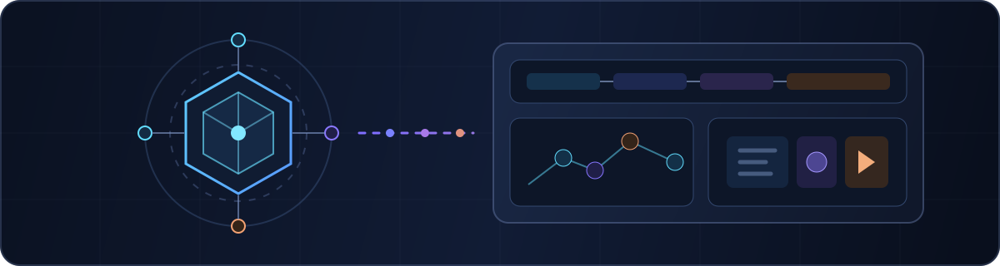
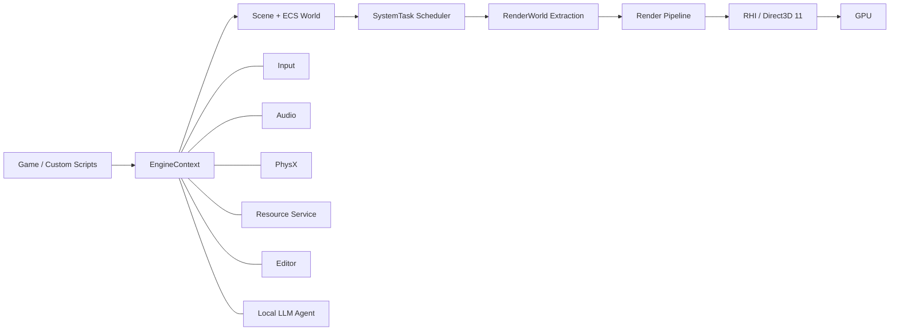

<p align="center">
  
</p>

<h1 align="center">GameEngine</h1>

<p align="center">
  ゲーム固有の要求に応じて、内部構造から拡張・変更できる個人開発ゲームエンジン。
  <br />
  <sub>A personal game engine built to understand, extend, and reshape every layer of the stack.</sub>
</p>

<p align="center">
  
  
  
  
  
  
</p>

<p align="center">
  <a href="#設計方針">Philosophy</a> ·
  <a href="#主な機能">Features</a> ·
  <a href="#アーキテクチャ">Architecture</a> ·
  <a href="#開発中のゲームプロジェクト">Projects</a> ·
  <a href="#ビルド">Build</a> ·
  <a href="#ライセンス">License</a> ·
  <a href="Docs/">Docs</a>
</p>

> [!IMPORTANT]
> 本リポジトリは完成済みのSDKではなく、ゲーム制作とエンジン研究を並行して進めている開発中のプロジェクトである。API、データ形式、内部構造は継続的に変更される可能性がある。

## 設計方針

<table>
<tr>
<td width="33%" valign="top">

### 内部構造を把握できること

ゲームループ、ECS、Renderer、Editor、Resource、PhysicsまでをC++コードとして追跡し、必要に応じて変更できる構造を目指している。

</td>
<td width="33%" valign="top">

### ゲーム側の要求へ適応すること

汎用エンジンの制約へゲームを合わせるのではなく、ゲーム固有のAdapterやServiceを追加し、必要であればEngine内部の契約も拡張する。

</td>
<td width="33%" valign="top">

### 基盤と体験を同時に検証すること

低レイヤー設計、並列実行、描画最適化だけでなく、カメラ、操作感、視認性、演出までを同一コードベース上で検証する。

</td>
</tr>
</table>

## 主な機能

| 領域 | 実装内容 |
|---|---|
| **Core / DI** | `EngineContext` によるService登録・取得・逆順Shutdown、複数Sceneの同時管理 |
| **ECS** | 世代付きEntity、複数Storage戦略、安全な `EntityRef` / `ComponentRef<T>`、Query / View |
| **Scheduler** | Phase / Priority / Access Hazardから依存を構築するSystemTask Scheduler、Job System、決定的な構造変更反映 |
| **Rendering** | DirectX 11、Deferred + Forward、PBR / Toon、CSM・Point・Spot Shadow、RenderWorld、Post Effect Graph |
| **Editor** | Hierarchy、Inspector、Asset Browser、Scene / Player View、Gizmo、Picking、Undo / Redo、Profiler |
| **Physics** | NVIDIA PhysX、Box / Sphere / Capsule / Mesh / HeightMap、Trigger、Layer Mask、Raycast |
| **Animation / VFX** | Compute Shader Skinning、Animation Blend、Particle、Effekseer、Terrain、Wave Mesh |
| **Scripting** | C++ Reflection、YAML Serialization、Inspector自動生成、C# DLL Hot Reload |
| **Local AI** | llama.cppを利用したEditor内ローカルLLM Agent、非同期推論、KV Cache、Context要約 |
| **Platform** | Win32 Window、Keyboard / Mouse / XInput、XAudio2、複数Windowを想定したService構成 |

## アーキテクチャ


```mermaid
flowchart LR
    Game[Game / Custom Scripts]
    Context[EngineContext]
    Scene[Scene + ECS World]
    Scheduler[SystemTask Scheduler]
    RenderWorld[RenderWorld Extraction]
    Renderer[Render Pipeline]
    RHI[RHI / Direct3D 11]
    GPU[GPU]

    Input[Input]
    Audio[Audio]
    Physics[PhysX]
    Resource[Resource Service]
    Editor[Editor]
    LLM[Local LLM Agent]

    Game --> Context
    Context --> Scene
    Scene --> Scheduler
    Scheduler --> RenderWorld
    RenderWorld --> Renderer
    Renderer --> RHI
    RHI --> GPU

    Context --- Input
    Context --- Audio
    Context --- Physics
    Context --- Resource
    Context --- Editor
    Context --- LLM
```

### Frame pipeline

```text
ECS World
  -> SystemTask Schedule
  -> RenderWorld Extraction
  -> GBuffer
  -> Shadow Map
  -> Deferred Lighting
  -> Forward / Transparency
  -> Post Effect Graph
  -> Overlay UI
  -> Editor / Player View
```

設計上の主要な境界は、ECS WorldをRendererから直接参照させず、CPU側で抽出したRenderWorldを介して描画情報を受け渡す点にある。Systemは処理単位となるTaskを生成し、SchedulerがRead / Write Accessから実行依存を構築する。

詳細な移行契約と進捗は [`Docs/ECS_Scheduler_Migration_Plan.md`](Docs/ECS_Scheduler_Migration_Plan.md) を参照。

## Rendering highlights

<table>
<tr>
<td width="50%" valign="top">

### Hybrid rendering

- Deferred + Forward pipeline
- Material別Shader切り替え
- PBR / Unlit / Toon / Rim Toon / PBR Toon
- Cascaded / Point / Spot shadow
- GPU skinning + CPU fallback
- Static batching / Culling / Render packet

</td>
<td width="50%" valign="top">

### Post effect graph

- Bloom / SSAO / SSR / Depth of Field
- Blur / Kuwahara / Posterize / Mosaic
- Glitch / Chromatic Aberration
- Normal / Depth / Shader ID outline
- Lens flare / God ray / Depth fog
- imnodes + Topological sort

</td>
</tr>
</table>

## Editor highlights

- Hierarchy検索、Drag & Drop、Prefab表示
- Component追加・削除とReflection Inspector
- Asset Preview CacheとAsset Browser
- ImGuizmoによるTransform操作
- GBuffer PickingによるScene選択
- Play / Stop時の一時保存・復元
- Undo / Redo Command System
- Schedule / Render / Performance可視化
- Editor内ローカルLLM Agent

## 開発中のゲームプロジェクト

エンジン機能は抽象テストだけでなく、異なるゲームジャンルへ実際に適用して検証している。

| Project | 検証している領域 | Development |
|---|---|---|
| **3D Platformer Tech Demo** | Character Controller、PhysX、Camera Zone、Checkpoint、Boss、演出 | [PR #47](https://github.com/tetoyama/GameEngine/pull/47) |
| **Mini-game Collection** | Multi-scene、短時間ゲームループ、CPU、Runtime UI、共通Presentation | [PR #48](https://github.com/tetoyama/GameEngine/pull/48) |
| **ElemenTactics** | Hidden information、決定的ルール、AI、LLM Action Adapter | [PR #50](https://github.com/tetoyama/GameEngine/pull/50) |
| **AgentOS** | ローカルLLM、複数Agent、Context管理、Editor統合UI | [`llm-agent`](https://github.com/tetoyama/GameEngine/tree/llm-agent) |

## ビルド

### Requirements

- Windows 10 / 11
- Visual Studio 2022
- MSVC v143 toolset
- Windows SDK 10.0
- x64 configuration
- C++20
- Shader Model 5.0

### Steps

```powershell
git clone https://github.com/tetoyama/GameEngine.git
cd GameEngine
start GameEngine.sln
```

Visual Studioで `Debug | x64` または `Release | x64` を選択し、`GameEngine` をビルドする。

> [!NOTE]
> 現在はWindows / DirectX 11を実動Backendとしている。上位描画層をNative API型から分離し、Direct3D 12 / Vulkanへ展開できるMulti-Backend RHIを段階的に構築中である。

## Repository layout

```text
GameEngine/
├─ Asset/                      Scene, Prefab, Shader, Model, Texture, Audio
├─ Script/                     Game-side scripts and experiments
├─ Source/GameApplication/
│  ├─ Engine/                  ECS, Scheduler, Renderer, Editor, Scene
│  ├─ Service/                 Engine-wide services
│  └─ Backends/                DirectX 11, PhysX, Assimp, llama.cpp, etc.
├─ Docs/                       Design contracts, migration plans, audits
├─ Tests/                      Structural and runtime smoke tests
├─ GameEngine.sln
└─ GameEngine.vcxproj
```

## Roadmap

現在の中心課題は次の通り。

1. ECS / Scheduler契約の強制と安全な並列実行
2. ECS WorldとRenderWorldの分離完了
3. Direct3D 11 Rendererの安定化とGPUボトルネック削減
4. Multi-Backend RHIの段階的実装
5. Editorの制作効率・可観測性・堅牢性向上
6. ローカルLLM AgentをチャットUIからタスク実行基盤へ発展
7. 複数ジャンルの実ゲームによるEngine API検証

進行中の詳細は以下に集約している。

- [ECS / Scheduler / RHI Migration Plan](Docs/ECS_Scheduler_Migration_Plan.md)
- [GPU Pixel Cost Optimization](Docs/Step19A_GPU_Pixel_Cost_Optimization.md)
- [Documentation index](Docs/)

## Third-party libraries

<details>
<summary>主な依存ライブラリとライセンスを表示</summary>

| Library | Purpose | License |
|---|---|---|
| [Dear ImGui](https://github.com/ocornut/imgui) | Editor UI | MIT |
| [ImGuizmo](https://github.com/CedricGuillemet/ImGuizmo) | 3D Gizmo | MIT |
| [imnodes](https://github.com/Nelarius/imnodes) | Post Effect Node Graph | MIT |
| [yaml-cpp](https://github.com/jbeder/yaml-cpp) | YAML Serialization | MIT |
| [Assimp](https://github.com/assimp/assimp) | Model Import | BSD 3-Clause |
| [Effekseer](https://github.com/effekseer/Effekseer) | Effect Rendering | MIT |
| [NVIDIA PhysX](https://github.com/NVIDIA-Omniverse/PhysX) | Physics | BSD 3-Clause |
| [llama.cpp](https://github.com/ggml-org/llama.cpp) | Local LLM Inference | MIT |
| [DirectXTex](https://github.com/microsoft/DirectXTex) | Texture Processing | MIT |
| DirectXMath / Windows SDK APIs | Math, Graphics, Audio, Input, Platform | Windows SDK terms |

詳細な帰属情報と運用方針は [`THIRD_PARTY_NOTICES.md`](THIRD_PARTY_NOTICES.md) を参照。

</details>

## ライセンス

本プロジェクトで独自に作成したソースコードおよび関連ドキュメントは、特に明記されていない限り [Apache License 2.0](LICENSE) の下で提供される。

Apache License 2.0は、商用・非商用を問わず、利用、複製、改変、派生物の作成、公開、再配布、サブライセンスおよび販売を許可する。改変したコードや、このエンジンを使用したゲームについて、ソースコードの公開は要求しない。

再配布時は、Apache License 2.0に従い、ライセンス全文の提供、適用される著作権・特許・帰属表示の保持、改変したファイルへの変更通知、および [`NOTICE`](NOTICE) に含まれる帰属表示の引き継ぎが必要となる。

ゲーム内、README、スタッフロールなどで目立つクレジットを表示することは必須ではないが、以下の形式による表記を歓迎する。

> Uses GameEngine by Tetora Yamazaki (tetoyama)

第三者ライブラリ、同梱された外部ソースコード、モデル、テクスチャ、音声、フォントその他の外部素材には、それぞれの権利者が定めるライセンスが適用される。これらは本プロジェクトのApache License 2.0によって再ライセンスされない。詳細は [`THIRD_PARTY_NOTICES.md`](THIRD_PARTY_NOTICES.md) を参照。

---

<p align="center">
  <sub>Designed and developed by <a href="https://github.com/tetoyama">tetoyama</a>.</sub>
</p>
